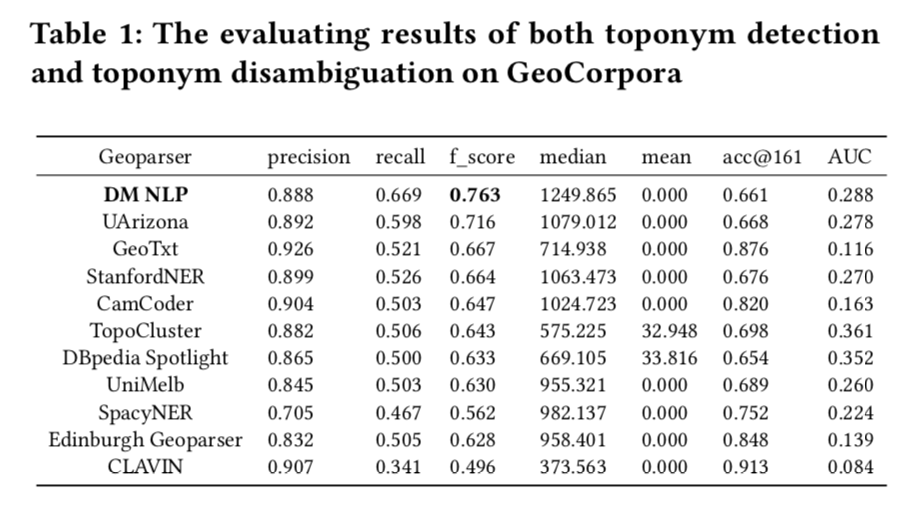
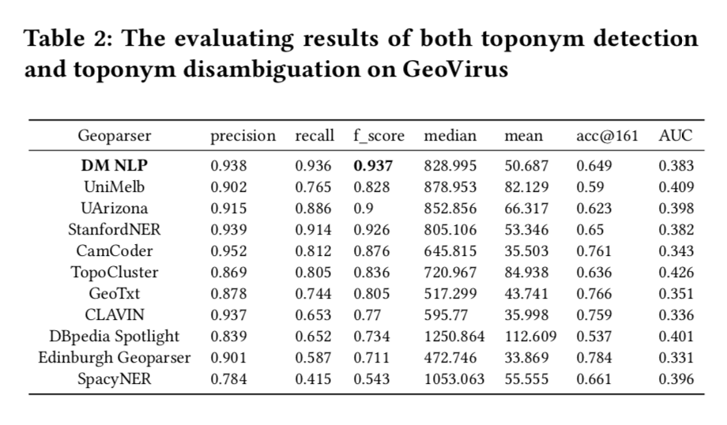
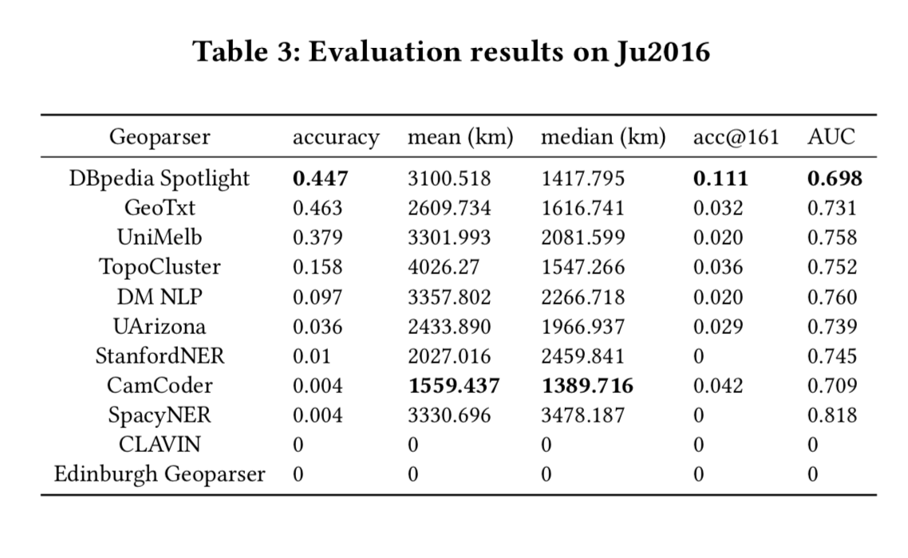
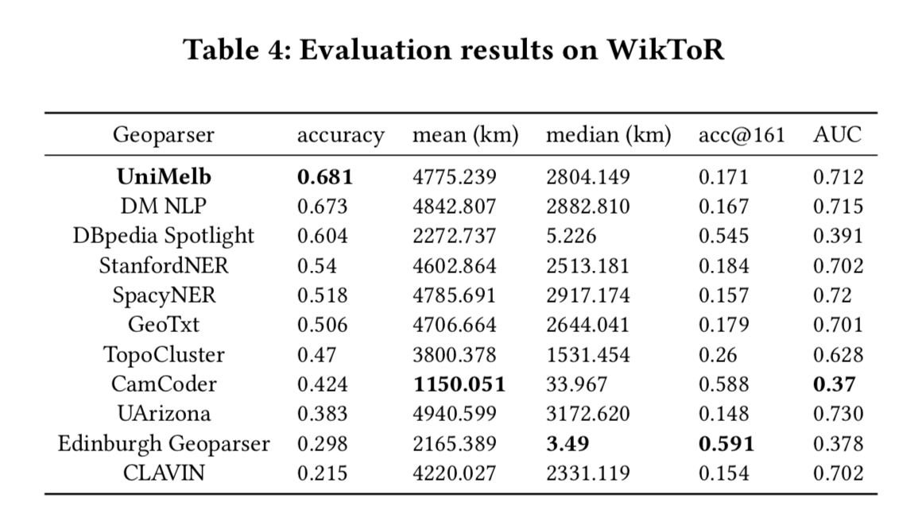
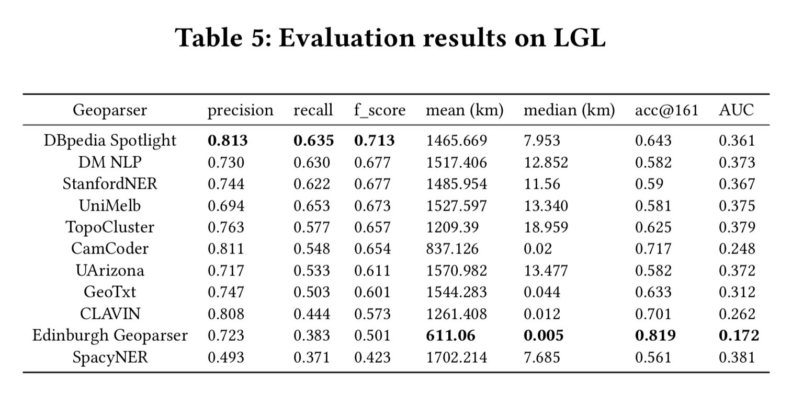
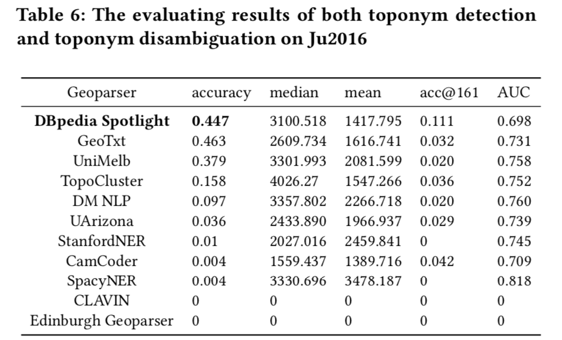
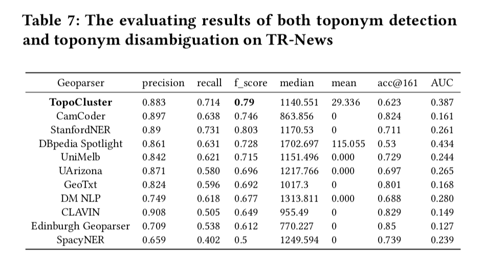

# Are We There Yet? Evaluating State-of-the-Art Deep Learning Geoparsers Using EUPEG as a Benchmarking Platform

### Introduction

This project systematically evaluates the top three geoparsers from the SemEval2019-Task12 competition:

* DM NLP: 	ELMo + charBiLSTM + wordBiLSTM + CRF, Keras
* UniMelb: 	ELMo + wordBiLSTM + self-attention + softmax, Keras
* UArizona:	Glove + charLSTM + wordLSTM + CRF, Tensorflow

The source codes hosted on this repository are our own implementations based on the descriptions of the papers.
For each one of the three geoparsers, we implement the toponym detetcion part based on the information provided in their papers, and use the population heuristic for toponym resolution.

### Repository organization

The whole repository contains codes for three parts:
* The toponym detection methods of three models;
* The population heuristics for toponym resolution;
* EUPEG corpus article examples;

### Geoparsing evaluation results

We test three restored models and eight other existing geoparsers using our benchmarking platform EUPEG. The source code of EUPEG can be found at: https://github.com/geoai-lab/EUPEG

The performance tables of all geoparsers on the eight tested corpora are provided as below:

