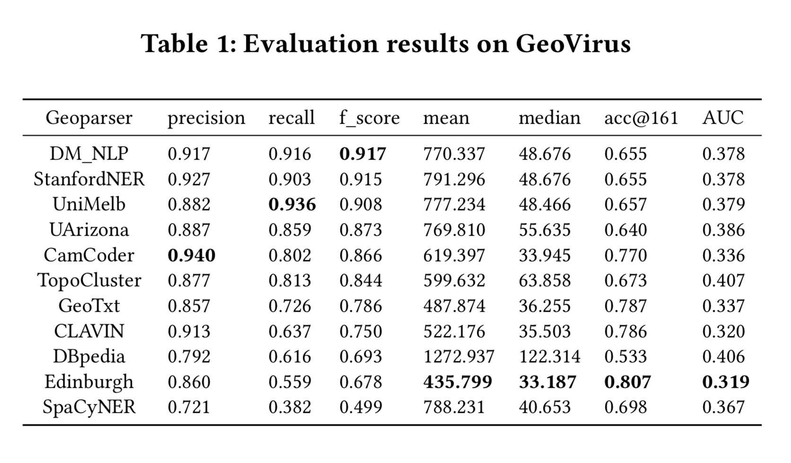
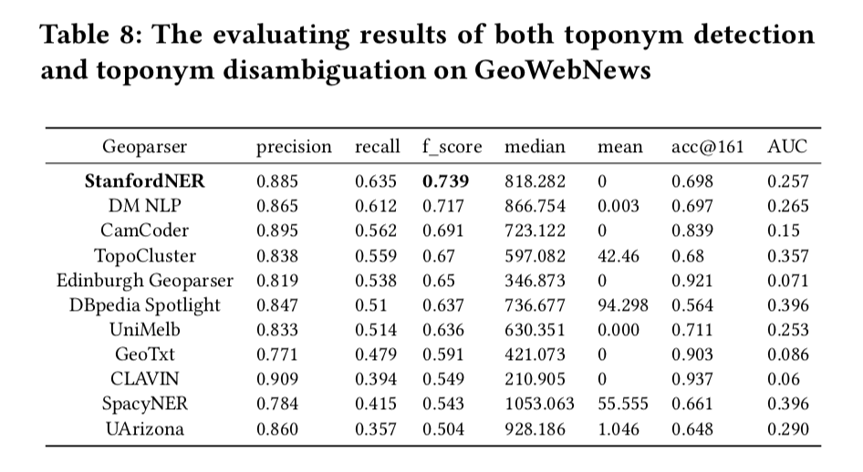

# Evaluating State-of-the-Art Deep Learning Geoparsers Using a Comprehensive Benchmarking Platform

### Introduction

This project restores the three top ranked toponym resolution systems (geoparsers) reported on SemEval2019-Task12:

* DM NLP: 	ELMo + charBiLSTM + wordBiLSTM + CRF, Keras
* UniMelb: 	ELMo + wordBiLSTM + self-attention + softmax, Keras
* UArizona:	Glove + charLSTM + wordLSTM + CRF, Tensorflow

### Repository organization

The whole repository contains three part:
* Three toponym detection methods;
* Population heuristics based toponym disambiguation;
* EUPEG corpus article examples;

### Geoparsing evaluation results

